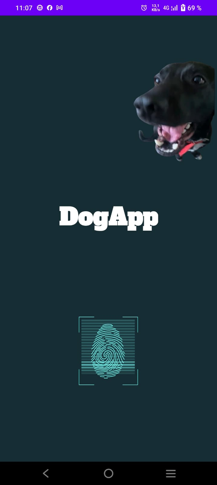

# 🐶 DogApp

DogApp es una aplicación móvil desarrollada en **Kotlin** con **Android Studio**, basada en la arquitectura **MVVM**. Su objetivo es proporcionar una experiencia interactiva para gestionar información sobre perros, integrando autenticación biométrica y una interfaz moderna.

## 🚀 Características

- **Arquitectura MVVM** con separación clara de responsabilidades.
- **Autenticación biométrica** mediante `BiometricPrompt`.
- **Interfaz moderna** con Material 3 y animaciones de LottieFiles.
- **Gestión de datos** con **Retrofit** para API y **Room** para almacenamiento local.
- **Sistema de navegación** optimizado con Android Navigation Component.
- **Soporte para edición, creación y eliminación de citas veterinarias.**
- **Autocompletado de razas de perros** usando la API pública de Dog CEO.
- **Carga de imágenes aleatorias de perros** según la raza seleccionada.

## 📂 Estructura del Proyecto

La estructura del proyecto sigue una arquitectura MVVM (Model-View-ViewModel) para garantizar una separación clara de responsabilidades. A continuación, se describe la organización principal:

- **app/**: Contiene el código fuente de la aplicación.
    - **model/**: Entidades de datos (por ejemplo, `Cita.kt`).
    - **database/**: Clases de Room (`CitaDao`, `CitaDatabase`).
    - **network/**: Lógica de acceso a la API (Retrofit).
    - **view/**: Fragmentos y adaptadores de UI.
        - **home/**: Pantalla principal de administración de citas.
        - **detail/**: Detalle y edición de citas.
        - **create/**: Creación de nuevas citas.
    - **viewmodel/**: Lógica de presentación y conexión entre UI y datos.
    - **utils/**: Utilidades y decoradores de UI.
- **res/**: Incluye recursos como layouts, strings, drawables y temas.
- **build.gradle**: Archivo de configuración para la compilación del proyecto.
- **AndroidManifest.xml**: Archivo de manifiesto que define la configuración general de la aplicación.

## 🛠️ Tecnologías y Librerías

- **Kotlin** y **Java** (compatibilidad).
- **Room** para persistencia local.
- **Retrofit** para consumo de API REST.
- **Material 3** y **Lottie** para UI moderna.
- **Navigation Component** para navegación entre fragmentos.
- **BiometricPrompt** para autenticación biométrica.
- **Glide** para carga eficiente de imágenes.

## 📸 Capturas de Pantalla
<p align="center">


</p>
<p align="center">


</p>

## 🚀 Instalación y Ejecución

1. Clona este repositorio:
   ```sh
   git clone https://github.com/leondominguez/Equipo3.git